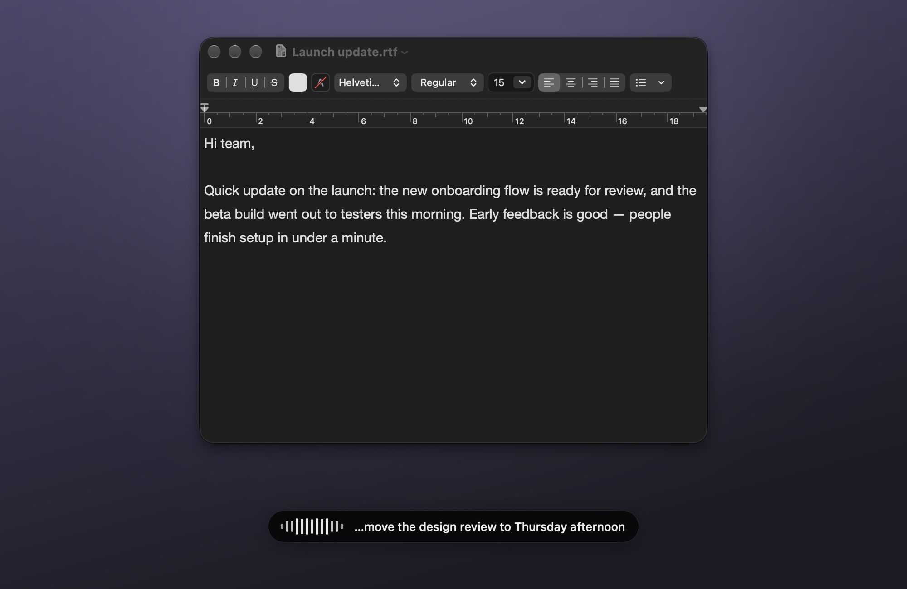
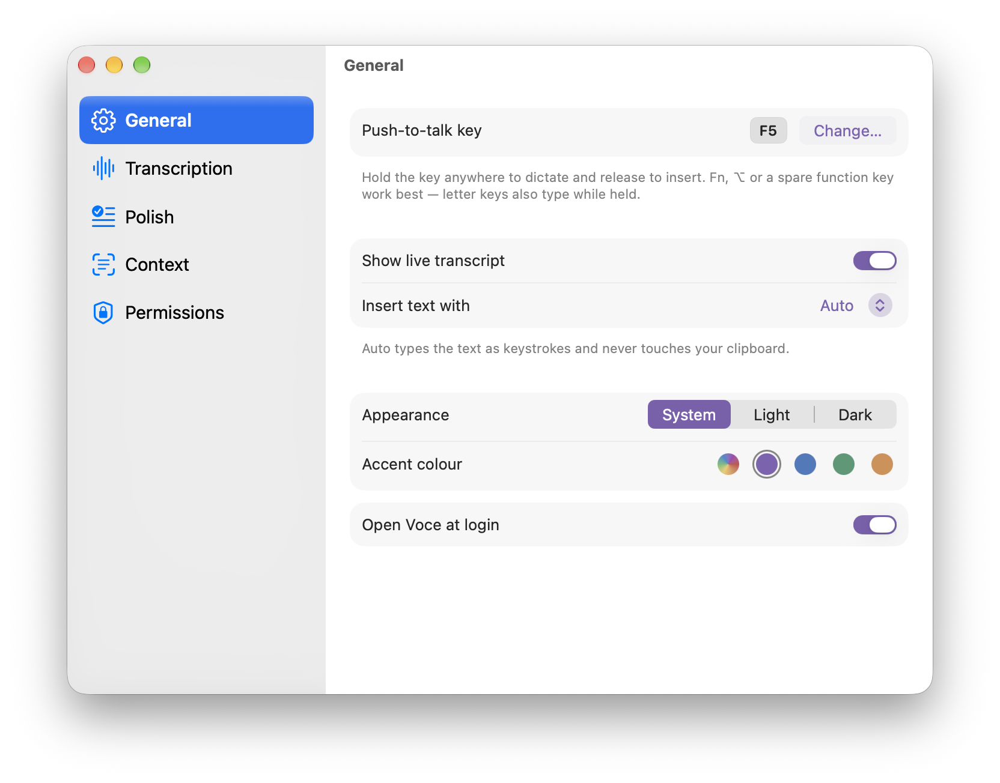
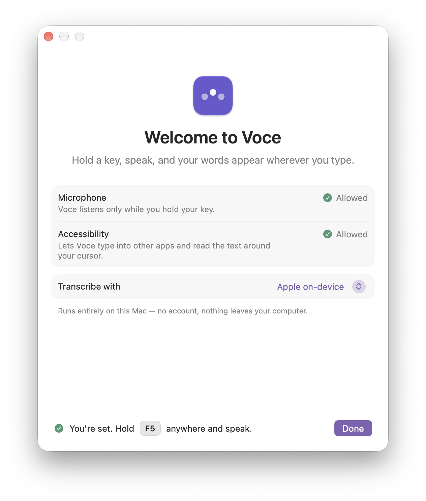

<div align="center">


# Voce

### Speak. It types.

Hold a key, say what you mean, and clean, punctuated text appears at your cursor — in any app on your Mac.

[](https://github.com/sgstq/voce/releases/latest)

<sub>Apple Silicon · macOS 26+</sub>

<br />



</div>

<br />

## Typing is slow. Talking isn't.

Voce lives in your menu bar and waits. When you want to write — an email, a Slack reply, a commit message, a prompt — hold your key and talk. Let go, and your words land exactly where your cursor is, with the *ums* gone and the commas in place.

No window to switch to. No copy and paste. It just types.

<table>
<tr>
<td width="33%" valign="top">

**Works everywhere**<br />
Mail, Slack, Notes, your browser, your editor, your terminal. If you can type there, you can talk there.

</td>
<td width="33%" valign="top">

**Sounds like you, only tidier**<br />
Voce drops filler words, fixes punctuation and matches the tone of the text around your cursor.

</td>
<td width="33%" valign="top">

**Private when you want it**<br />
Transcribe and polish entirely on your Mac with Apple's on-device models. No account, nothing leaves your computer.

</td>
</tr>
</table>

## How it works

1. **Hold** your push-to-talk key (<kbd>F5</kbd> by default, or pick your own).
2. **Speak.** A small capsule at the bottom of the screen moves with your voice.
3. **Release.** Your text appears at the cursor in about a second.

That's the whole app.

## Made for macOS

Voce looks and feels like part of your Mac: a native settings window, light and dark mode, and a quiet capsule that never steals focus and disappears the moment you let go.

<table>
<tr>
<td width="58%" valign="top">
<picture>
  <source media="(prefers-color-scheme: dark)" srcset="assets/screenshots/settings-general-dark.png" />
  
</picture>
</td>
<td width="42%" valign="top">
<picture>
  <source media="(prefers-color-scheme: dark)" srcset="assets/screenshots/onboarding-dark.png" />
  
</picture>
</td>
</tr>
<tr>
<td align="center"><sub>Settings, in the style of System Settings</sub></td>
<td align="center"><sub>A short welcome gets you set up</sub></td>
</tr>
</table>

## Everything else you'd want

- **Multilingual.** Detects the language you're speaking, even if you switch mid-sentence.
- **Context-aware.** Reads the text around your cursor, and optionally the active window, so names and terms come out right.
- **Your choice of engine.** On-device, or OpenAI and Deepgram for the fastest streaming. Polish with Apple Intelligence, OpenAI, Groq or Cerebras.
- **Clipboard-safe.** Text is typed as real keystrokes, so your clipboard is never touched.
- **Light on your Mac.** No Dock icon, optional launch at login, and almost no CPU while idle.

## Privacy

Voce keeps no recordings and no transcripts. It listens only while you hold your key. If you use a cloud provider, audio goes to that provider only while it is being transcribed. Your API keys stay in the macOS Keychain.

## Install

**[Download the latest release](https://github.com/sgstq/voce/releases/latest)**, open the DMG and drag **Voce** into Applications. On first launch, a short welcome window asks for Microphone and Accessibility access, and you're ready.

Requires macOS 26 or later on Apple Silicon.

<details>
<summary>Build from source</summary>

<br />

Requires Xcode and [XcodeGen](https://github.com/yonaskolb/XcodeGen).

```bash
scripts/install.sh          # build and install to /Applications
scripts/package.sh 0.1.0    # or build a drag-to-install DMG in dist/
```

</details>

---

Warning
---
<div align="center">


  <b>ALL CODE AND SCRIPTS IN THIS REPOSITORY—EVEN THOSE BASED ON REAL DOCUMENTATION—ARE ENTIRELY EXPERIMENTAL. ALL LOGIC WAS HALLUCINATED BY MATRIX MULTIPLICATIONS….. HAPHAZARDLY. THE FOLLOWING REPOSITORY CONTAINS UNTESTED CODE AND DUE TO ITS CONTENT IT SHOULD NOT BE USED ANYWHERE BY ANYONE ■</b>

  
</div>
